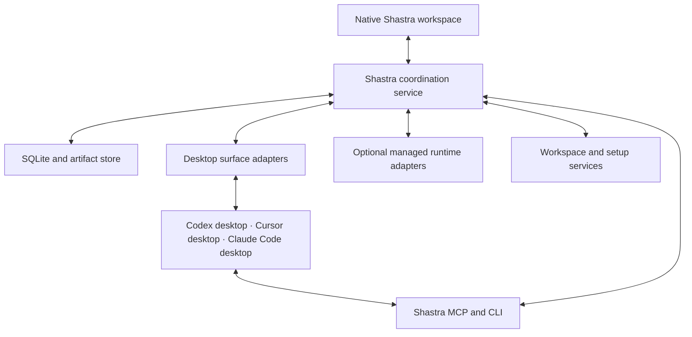

# Shastra desktop continuity and coordination build plan

Prepared September 30, 2026. Status: implementation specification; desktop round trips are not yet verified. This document supersedes the delivery order and session-continuity assumptions in the earlier AgentDesk plan at `/Users/arkokoley/Downloads/PLAN.md`. `PLAN_STATUS.md` continues to describe shipped behavior.

Shastra should let you work in an existing Codex, Cursor, or Claude Code desktop conversation, continue through Shastra or another agent, and return to the original desktop conversation with the intervening work accounted for. Agents should delegate and message one another across those apps using the same Shastra tools. The native macOS workspace should borrow Orca's navigation and workspace organization.

The central implementation choice is to preserve native desktop sessions and add a coordination service around them. A command-line session, a copied transcript, or a new chat with the same title does not prove desktop continuity. Supported runtime APIs can be implementation details only when tests establish the required desktop behavior.

## 1 Product contract

### Required user journeys

| Journey | Required result |
|---|---|
| Pick up an existing desktop thread | Find it by project, title, app, or message content; show its source and history completeness; continue against that exact native thread where the adapter has passed the desktop gate. |
| Return to the original app | Open the original desktop thread, see the turns performed through Shastra, send another message there, and see that message return to Shastra. |
| Change agents and come back | Continue a logical conversation in another app's native agent thread, then deliver an explicit catch-up message into the original thread before continuing there. Preserve both native identities. |
| Delegate across apps | From a Codex desktop conversation, create a Claude Code desktop worker and a Cursor desktop worker; workers appear in their respective apps and in Shastra. |
| Coordinate peers | Address an existing sibling thread, send a bounded assignment or question, wait for its result, and receive completion or a request for input. |
| Use several subscriptions | Select a verified account for an execution without silently changing other running agents or the desktop app's account. Display unsupported account/surface combinations. |
| Leave and return | Closing Shastra's window does not destroy coordination state. On restart, reconcile native apps, pending messages, approvals, and workspaces before continuing. |
| Carry setup across apps | Compatible skills, project instructions, GitHub integrations, and computer-use tools are available and smoke-tested in the destination app. |

The initial desktop targets are Codex local desktop coding threads, Cursor IDE Agent and Agents Window local threads, and the Claude Desktop Code tab's local sessions. Record Cursor IDE and Agents Window as distinct surfaces until proven compatible. Claude Chat, Cowork, remote/cloud threads, and terminal-only sessions must never be silently substituted for these targets. Existing Grok support remains available; additional providers follow the original three desktop gates.

### Meaning of continuity

Use three explicit states in the UI:

- **Same thread:** the native endpoint identity is unchanged and the original app confirms new turns.
- **Linked continuation:** another endpoint performs work; the shared logical conversation connects the histories and tracks what each endpoint has received.
- **View only:** Shastra can inspect the source but cannot reliably send into it yet.

“Open in app” means navigation. “Continue in app” additionally verifies that the intended endpoint has the necessary context. A new native thread is never labeled as the original thread. Unsupported desktop operations remain visible product gaps; a linked continuation does not satisfy a same-thread acceptance test.

Native transcripts remain authoritative for what happened inside a native thread. Shastra is authoritative for relationships, coordination, delivery state, workspace assignments, and handoff records. There is no single physical transcript shared by all vendors.

## 2 Current implementation and required changes

| Area | Evidence in current source | Required change |
|---|---|---|
| Conversation identity | `Sources/ShastraCore/Models.swift` stores one provider, account, and vendor session ID per conversation. | Separate logical conversation, native endpoint, execution attempt, and account binding. Preserve every endpoint. |
| Continuation | `Sources/ShastraApp/ShastraApp.swift` starts a new session on reconnection and supplies eight messages capped at 6,000 characters. | Native endpoint routing plus durable context checkpoints and per-endpoint catch-up. |
| Execution | `Sources/ShastraCore/AgentSession.swift` launches Codex app-server, Cursor/Grok ACP, or the Claude SDK bridge. | Keep as managed-runtime adapters; add separate desktop-surface adapters. |
| Import | `ConversationCatalog.swift` reads different native sources and stores source metadata. | Incremental observation with stable source item IDs, completeness, account/store namespace, and source revision. |
| Refresh | Selected history can replace the entire `entries` array; source refresh depends on matching the current vendor ID. | Append/reconcile endpoint events without overwriting the logical conversation or losing an older source after a handoff. |
| Activity | Tool events are largely reduced to text; approvals/questions live in the app model. | Typed events with native IDs, request lifetime, endpoint, raw payload references, and independent native subagent identities where exposed. |
| Persistence | `ConversationStore.swift` atomically rewrites one JSON array. | SQLite migrations, incremental events, durable outbox, indexes, and recovery journal. |
| Ownership | Process state lives in the UI; reopened active records become interrupted. | Service-owned coordination and reconciliation with externally owned desktop processes. |
| Accounts | Isolated managed profile directories exist. | Prove actual desktop profile support independently; retain account isolation for managed execution. |
| Workspace | Repository grouping, native previews, terminal, browser, and read-only diffs exist. | Add workspace lifecycle, change snapshots, assignments, integration, and recoverable archive. |

Retain the working SwiftUI shell, AppKit renderers, account import code, history readers, workspace identity resolver, terminal, browser, and existing fixtures. Refactor behind their interfaces incrementally. Do not begin with a UI rewrite.

## 3 Desktop integration strategy

### Two adapter families

`DesktopSurfaceAdapter` identifies and operates actual app threads. It must report the app build, surface, native thread identity, account visibility, navigation ability, send/observe/cancel capabilities, and how control is established.

`ManagedRuntimeAdapter` wraps the existing subprocess protocols. It is useful for compatible execution and optional headless workers, but its successes are recorded separately. A subprocess using the same model or engine is not automatically a desktop endpoint.

Prefer integration paths in this order:

1. A documented app-control API that targets the existing desktop thread.
2. An app-hosted extension/plugin and supported hooks for thread binding, lifecycle events, and tool registration. Prove inbound send and idle wake separately.
3. A tested shared-runtime connection, only after proving the desktop is attached to that same session and the connection preserves its app-specific capabilities.
4. A versioned macOS Accessibility adapter for navigation and prompt submission, with native event/history observation for confirmation.

Read-only local stores can supplement discovery and history. They are not a write API. Do not modify live JSONL, SQLite stores, desktop bundles, or private authentication material to inject turns. Do not base production on undocumented internal sockets merely because their paths can be discovered.

### Evidence and unresolved questions

| Surface | Evidence available now | First proof required |
|---|---|---|
| Codex desktop | This host exposes app-context tools for reading, creating, and messaging native chats. Installed Codex CLI 0.150.1 also exposes shared-server commands. Neither fact establishes a supported external Shastra control API. | A supported external or app-hosted route must address a disposable desktop thread, send a turn, and show the turn in that same desktop thread. Verify app-specific tools remain available. |
| Cursor IDE and Agents Window | Official support says IDE and CLI stores are separate. Official extension APIs and hooks offer useful integration points; SDK engine equivalence does not prove local desktop session equivalence. | Bind each desktop surface's actual conversation identity; observe native turns; test a supported send route or Accessibility route; return to that exact thread. |
| Claude Desktop Code | Official docs describe native sibling-session tools. The engine documents an inbox socket for scripts/hooks; its complete wire contract and availability in the installed desktop build remain unverified. | Bind an existing local Code session through observed native identity and hooks; test exact-thread navigation, inbound send, app tools, and return behavior. |

Facts above are research inputs, not compatibility certifications. [Desktop compatibility research](Docs/DesktopCompatibility.md) records the baseline and the first proof procedures. Every certified capability must have a test run ID and app version. A vendor update invalidates assumptions and triggers a cheap probe before control resumes.

### Provider implementation order

For Codex, install Shastra's agent-facing MCP/plugin and use trusted lifecycle events for enrollment and observation. Test a supported desktop control path; otherwise prototype narrow Accessibility submission. Do not reuse the app's internal tool pipe or fabricate its executor metadata. App-context tools prove the host can coordinate its own threads, not that an external client inherits that authority. Codex hook session identifiers and subagent identifiers must be mapped to the actual native thread identity; do not equate a session-tree root with every descendant thread.

For Cursor, begin with a companion extension that registers the Shastra MCP/plugin and supported hooks. Use observed conversation/generation identity and source revisions for mirroring. A stop hook can deliver a queued follow-up at a turn boundary; separately prove idle wake and exact-thread navigation. If there is no supported local-thread control API, test Accessibility for those operations. Treat cloud SDK visibility as an optional future surface, not the local desktop solution.

For Claude, first test the documented session inbox from a hook running in the actual Desktop Code session. The docs expose a socket location and per-session authentication to hooks; establish the payload/receipt contract and desktop applicability before adopting it. Treat delivered, held, and refused as distinct outcomes and preserve native inbound controls. Keep credentials in a local credential reference, never in prompts, transcripts or diagnostic logs. If that path fails, test the same narrow UI fallback. The documented existing-chat deep link addresses Claude Chat; exact local Code navigation requires its own proof. New-Code links prefill a composer and require folder confirmation rather than proving unattended creation.

### Companion integration

Expose one Shastra MCP tool surface to models in all three desktop apps. Use each app's supported installation and configuration mechanism. Hooks and extension events report native thread IDs and lifecycle where available. This supplies outbound delegation and result publication.

Inbound delivery is a different problem. An MCP server cannot generally push a new model turn into an idle client just by emitting a tool result. Implement a `DeliveryDriver` for each native surface. Separate active-turn delivery through supported steering/safe-boundary hooks from idle wake through a verified direct-control or UI route. In particular, Codex background hook completion while idle waits for a later user turn. An adapter that only receives outbound calls must report `canWakeIdleThread = false`.

Bind tools to the actual calling endpoint through trusted host metadata when available. For apps without it, test a one-use enrollment nonce correlated with the observed native turn during P0. Persist a principal/grant with allowed endpoints, tasks, workspaces, expiry/revocation, and delegation limits. A user-private socket authenticates the local user; it does not establish which model or thread called. Do not trust a model-supplied thread ID or a shared app-wide MCP credential as proof of per-thread identity. If a shared MCP connection cannot distinguish concurrent chats reliably, expose only scoped operations supported by an explicit binding; leave unrestricted sibling control unavailable until binding is solved.

### Accessibility fallback contract

Accessibility is a supported fallback adapter with explicit limits, not an invisible universal API. It should:

- Target an observed app/window and verified native thread; titles alone are insufficient when ambiguous.
- Navigate by stable accessibility elements or documented deep links, with a fresh state read before sending.
- Preserve unsent user drafts; never replace a draft just to deliver an agent message.
- Serialize UI actions through a desktop resource lease. Concurrent inference may continue after each dispatch.
- Check account, folder, thread, and busy state immediately before submission.
- Verify the new native user turn or acknowledgement after submission; a successful keystroke is not delivery.
- Stop automatic retries if acceptance is uncertain. An inaccessible or locked screen becomes `waitingForDesktop`.
- Report when focus must move, and yield to user interaction. Do not simulate unattended reliability when a dialog or app update has changed the UI.

No UI automation is required to browse ordinary history when a reliable read interface exists. Do not embed or relocate other apps' windows into Shastra as a core architecture dependency.

## 4 Orca inspired interaction design

The following patterns were observed in the installed Orca desktop app through accessibility and screenshots on September 30: project/worktree hierarchy, active/inactive and PR indicators, a workspace board, a jump palette spanning chats/terminals/worktrees/actions, an indexed session inspector with Workspace/Project/All scopes, a right-side checks and review panel, and a compact usage/resource footer. No underlying coordination guarantees are inferred from those controls.

Orca's CLI could not load its guide on this machine: `Unable to determine Orca.app path from symlink: /usr/local/bin/orca`. The UX observations came from the visible app instead. Private workspace titles and review contents are not part of this specification.

### Workspace layout

Keep three resizable regions. On the left, show Inbox, pinned conversations, then projects with workspaces and their chats. In the center, show the selected conversation with optional split view for a worker or review. On the right, show Files, Changes, Agents, Checks, and Context as inspector tabs. A terminal or browser is an ordinary workspace tab rather than a prerequisite for talking to an agent.

At the top of a conversation show its current desktop app, runtime/model when exposed, account, workspace/branch, and status. Place **Continue with**, **Open in original app**, and **Add agent** close to the composer. Keep transport details and native IDs in an inspector.

Each sidebar row has a title, a small app icon, unread marker, and meaningful state. Use needs-input/running/waiting/completed text in addition to color. Keep PR and branch metadata compact. Opening a chat must preserve its draft, scroll position, inspector tab, and split arrangement.

The jump palette searches conversations, message bodies, workspaces, files, and actions. Preserve existing Cmd-K and Cmd-Shift-P entry points and optionally offer Cmd-J for Orca familiarity. Keyboard navigation must reach every action without requiring hover.

The optional board shows Todo, Running, Needs input, In review, and Done. It is another view over the same tasks, not a second database of status. Board position is user workflow state; runtime activity remains separate. Finishing a turn does not automatically finish a task.

### Three key flows

**Pick up:** search a desktop thread, open it, see its source and capability status, send a message. If exact-thread delivery is supported, use it directly. If unavailable, show the concrete limitation and offer a separately labeled linked continuation. Never silently downgrade a same-thread request.

**Switch and return:** select the destination app/account, see the chosen workspace and a compact context status, then continue. The timeline adds a handoff marker. Returning to the original app automatically prepares only the missing context; once accepted, opens that endpoint. Normal transfers do not demand repeated confirmation dialogs. Vendor-required confirmations still apply; Claude Code deep links always require confirmation of a supplied folder.

**Delegate:** use Add agent or ask the current agent. Worker cards show assignment, app/account, workspace, last activity, and whether input is needed. Open a card to read or message the worker. Parent-child and sibling relationships appear in the Agents inspector. Inter-agent messages remain visible and attributable, without flooding the main conversation with polling output.

Approvals and questions go to one attention inbox with the originating app/thread and a direct route to answer. Shastra may answer only requests its adapter actually controls; otherwise open the native approval. Desktop input waiting, quota waiting, and failed delivery are different states.

## 5 Service architecture

Keep Swift 6, SwiftUI, and AppKit. Add a per-user `ShastraService` registered through `SMAppService`, plus a small `shastra` CLI/MCP front end for integrations. Start with local-machine support.

The service owns dispatch, delivery, event persistence, subscriptions, workspace assignments, and recovery. Native apps keep their own execution engines and tools. Model planning stays inside the selected agent; Shastra does not implement a replacement model loop.

Use versioned JSON-RPC over a user-private Unix socket for local clients; a stdio MCP front end forwards requests to that socket. Restrict socket access to the user. If a desktop supports only HTTP MCP, add a loopback authenticated adapter with origin checks rather than exposing a network-wide listener. Keep schema negotiation explicit.

Use SQLite through GRDB with migrations, WAL, foreign keys, and FTS5. One service writes orchestration state. Store normalized events and necessary raw provider payloads/artifacts separately so large histories do not make every state update expensive. Coalesce UI text updates while persisting ordered event batches; never infer completion from a quiet stream.

Start the service core in-process for unit tests and early development, but preserve the exact service API. Move it behind the helper before claiming restart/background guarantees. Do not duplicate orchestration logic in the UI and helper.

## 6 Data model and invariants

| Entity | Required fields and purpose |
|---|---|
| Project / Workspace | Stable repository identity, canonical path, worktree ID, branch/base commit, setup version, lifecycle and snapshot references. |
| Conversation | Permanent Shastra ID, title, project, preferred workspace, active endpoint, user draft and logical task links. No single provider owns it. |
| DesktopInstance | Stable host/store/profile identity, current app bundle/build/path, surface, supported instance locator, observed logged-in identity and connection health. Identity survives app updates and reauthentication. |
| NativeEndpoint | Provider, surface, installation/profile namespace, native thread ID, locator/open handle, account binding, capability snapshot, observation cursor, ownership mode. |
| ConversationEndpoint | Logical conversation membership, parent/fork/handoff relationship, attach time, delivered context revision. Native endpoint history is not duplicated when related to multiple tasks. |
| ExecutionAttempt | Endpoint, task, account/model as observed, turn ID, dispatch operation ID, start/end state, failure category and result. |
| Event / ContentBlock | Native item ID, endpoint sequence/revision, role, text/tool/attachment/reference, timestamps, provenance, raw payload reference, completeness. |
| Task / TaskEdge | Objective, acceptance criteria, owner, dependencies, status, result, parent or sibling relationship. |
| Delivery | Sender/recipient endpoints, message type, correlation ID, parent message, idempotency key, payload reference, delivery state and native acknowledgement. |
| Handoff | Source/target, common context revision, source/target cursors, workspace snapshot, capsule, state, acceptance evidence. |
| ContextCheckpoint | Causal frontier mapping each endpoint to a native cursor, plus exact included event IDs/hashes and workspace revision. Coverage is not a wall-clock timestamp. |
| Principal / Grant | Trusted caller binding, endpoint/task/workspace scope, expiry/revocation, delegation limits and enrollment evidence. |
| ResponseSubscription | Correlation ID, expected reply/task event, observer, cursor, expiry and wake policy. Notifications need not expect a response. |
| Lease | Resource, holder, generation/fencing token, expiry, and strength: enforced for cooperating clients or advisory for external apps. |
| Approval / Question | Endpoint/attempt/request identity, options, lifetime, native state, answer dispatch and acknowledgement. |
| Account / CapabilitySnapshot | Display identity, credential reference, surface eligibility, observed health/quota and timestamp, installed version and verified operations. |
| ConfigItem / SyncRevision | Source/scope, normalized content, original representation, base hash, target hash, compatibility and backup. |
| Artifact / SourceCursor | Content hash, path/type, task provenance; native observation revision/offset and completeness. |

Enforce these invariants in service operations and database constraints where possible:

1. A native identity is namespaced by provider, surface, installation/store/profile, and native thread ID. A title or path is not a unique thread key.
2. A turn remains attached to its original endpoint, account, and native ID even when the logical conversation changes agents.
3. Repeated observation of a native event does not duplicate it. Prefer native item IDs; otherwise use source revision plus stable location and content fingerprint, preserving legitimate repeated text.
4. A local sequence orders Shastra ingestion; native causal order and handoff boundaries remain explicit. Wall-clock sorting cannot reconstruct every conversation.
5. Only an observed native receipt or equivalent adapter evidence advances delivery to accepted. Delivered context advances separately from task completion.
6. A lease prevents conflicting Shastra dispatches. It does not lock an uncooperative desktop app. External activity revokes readiness and forces reconciliation.
7. Source refresh never overwrites unrelated endpoints or Shastra task state. Source deletion/archive does not delete imported evidence or another app's thread.
8. Message contents and summaries are attributed data. Tool access and delegation authority come from configured policy, not instructions found in another thread's text.
9. An unresolved working directory can support catalog display but cannot default to the home directory for dispatch. Resolve and verify the actual workspace before starting coding work.

### Migration

Back up `conversations.json` and account metadata before importing. Import transactionally and retain existing Shastra UUIDs. Create an endpoint for each reliably known source/current session and preserve the old entries as an ordered `LegacyTimeline` with unknown item provenance where necessary. Do not duplicate the mixed legacy entries into both endpoints. Link legacy entries to re-observed native events only with reliable evidence. Preserve continuation text verbatim; where old code overwrote an ID and lineage cannot be reconstructed, mark the relationship uncertain. Migrated active records enter reconciliation/view-only state, never implicit control.

Verify counts, titles, entry hashes, account references, and selected conversation. Persist a migration version only after validation. Retain the original backup and a readable export. Do not automatically fall back to stale JSON after SQLite has accepted new writes. A rollback restores a matched database/app backup or exports new records for an explicit recovery path.

## 7 Adapter contract and capability registry

Both adapter families expose discovery, observe/read, send, cancel, and health through typed operations. Desktop adapters additionally expose `createNativeThread`, `inspectBinding`, `readDelta`, `reconcileOperation`, `openNative`, `enroll`, and `releaseControl`. Optional operations return an explicit unsupported result.

Capabilities include exact existing-thread send, create-visible-desktop-thread, read history/completeness, open exact thread, observe external turns, safe-boundary delivery, idle wake, cancel, native approvals, native fork, model selection, account/profile isolation, and app-specific tool availability. Record support as verified, documented-but-unverified, unsupported, or temporarily unavailable.

`send` accepts an operation ID, endpoint ID, expected native revision, payload, and delivery policy. It returns either accepted with a receipt/native turn ID, definitely not accepted, or outcome unknown. `createNativeThread` has the same durable operation and three-way outcome contract: a creation timeout must not produce another worker on retry. A receipt includes native thread/turn identity, desktop instance, observed account, evidence kind, source revision and time. Neither operation invents vendor idempotency support.

The service envelope contains `schemaVersion`, `requestID`, `operationID`, the authenticated principal, expected endpoint revision, and the typed payload. Mutations deduplicate by principal plus operation ID and return the persisted result on retries. `readDelta` and event subscriptions use resumable cursors. Keep transport timeout separate from operation failure: a client can reconnect and call `reconcileOperation` without starting another operation.

Keep vendor-specific details below the adapter boundary. Retain unknown event fields. Add timeouts and cancellation to `JSONRPCProcess` calls, and carry endpoint/attempt IDs through all event handling. ACP initialization must inspect optional capabilities rather than assuming session loading or MCP injection works. Do not treat the current bridge's generic ACP-like facade as proof of a vendor capability.

## 8 Continuity protocols

### Same desktop thread through Shastra

1. Resolve the native endpoint and current app/account/workspace; hydrate available history and source cursor.
2. Identify its current controller and activity. Prefer sending through the already owning app. If a verified attach route exists, attach as another client to that controller rather than starting a second writer.
3. Persist the outgoing operation before dispatch. Queue at a supported boundary if the app is busy.
4. Send through the desktop adapter, record native acceptance, then observe response/tool/approval events.
5. Open the original desktop thread on request; refresh from the native source after the user works there.

If ownership cannot be established, do not resume the same native store in an independent process. Offer view-only or an explicitly linked continuation. A stopped-looking UI, unchanged file timestamp, or absence of output is not sufficient ownership proof.

### Another runtime or app, then back

Handoff state machine:

`requested → waitingForSource → checkpointed → targetPrepared → sending → accepted → active`

Exceptional states: `cancelledBeforeSend`, `failedBeforeAcceptance`, `acceptanceUnknown`, `needsReconciliation`. Persist each transition. A target failure before acceptance leaves the source addressable. After uncertain acceptance, inspect the target before retrying or restarting the source.

The handoff capsule contains the user objective and constraints; decisions with source references; task status and open questions; relevant messages, tool results, attachments and artifacts; workspace path and repository identity; commit, staged/unstaged/untracked change manifest; tests with command/result/revision; and tools or permissions available at the source but absent at the destination.

Build the capsule from durable state first. An optional model summary can compress relevant history, but must retain citations and cannot turn an unverified claim into a fact. Keep the complete available transcript accessible through scoped read/search tools. Respect the target's actual context budget; never silently drop an arbitrary prefix as the current 6,000-character fallback does. If history is incomplete, record that in both the UI and capsule.

When returning to endpoint A after work in B, calculate the delta from A's last accepted context checkpoint. Refresh A first: the user may have continued it independently. Compare both branches against their common causal frontier. Preserve divergent instructions and results; surface genuine contradictions instead of overwriting either branch. The catch-up manifest retains original event IDs/hashes and advances A's coverage only after correlated native acceptance. Observing that catch-up in A must not make its embedded source events appear to be new work to send back to B.

For **Continue with**, combine the attributable catch-up and latest user request into one ordered envelope when supported. If the user requests a context transfer without new work, tell the receiving agent to acknowledge context and await input. **Open in original app** only navigates; it does not start an unsolicited turn. Other agents' turns remain a catch-up record, not forged native assistant messages.

A normal handoff keeps the same workspace after the old writer has settled. Choosing a different workspace invokes an explicit snapshot/transfer operation. Existing terminals and running processes are referenced by ownership and location; they are not magically migrated or restarted.

## 9 Agents and sibling communication

Expose a compact shared tool vocabulary:

| Tool | Contract |
|---|---|
| `agents.spawn` | Create a task and visible desktop worker using requested app/account/model, workspace policy, context policy, and acceptance criteria. Return operation/task/endpoint handles. |
| `agents.list` | Scoped agent/task status and capabilities, not every private conversation by default. |
| `threads.read` / `threads.search` | Cursor-based access to authorized history and artifacts with provenance and completeness. |
| `agents.send` | Deliver an assignment, question, answer, update, or result to a known endpoint; return delivery state. |
| `agents.wait` | Wait on task/delivery events from a cursor; bounded waits and resumable subscriptions; no repeated transcript polling. |
| `agents.handoff` | Transfer the logical task through the continuity protocol; preserve endpoint lineage. |
| `agents.cancel` | Cancel pending work and request native cancellation of active attempts; wait for acknowledgement. |
| `tasks.complete` / `tasks.blocked` | Publish result/artifacts/test evidence or a concrete blocker; notify interested peers. |
| `workspaces.allocate` / `workspaces.integrate` | Create isolated derived work or bring verified changes into the requested target. |

Child and sibling relationships use the same endpoint and task models. A native vendor subagent remains a native subagent unless it can be independently addressed. Do not flatten every tool event into a new Shastra worker, or pretend a cross-app worker belongs to the vendor's internal subagent system.

Use a durable mailbox/outbox. Delivery transitions are `queued → dispatching → accepted → nativeObserved`, with `notAccepted`, `unknown`, `cancelled`, `held`, and `needsInput` alternatives. Transport state ends with evidence of delivery; replies are tracked by a separate response subscription and task outcomes by `Task`. Notifications and answers need not trigger another response. If model-read receipts are unavailable, do not claim the model read the message.

Default to four runnable agent tasks, with separate limits for actual active native turns per app/profile and foreground UI dispatch. Use configurable delegation depth, per-task spawn limits, and correlation IDs to prevent accidental reply loops. A notification does not automatically demand a reply. Detect dependency cycles and self-waits. Waiting parents release scheduler slots, but a blocked MCP call may still occupy a real native turn. Bound `agents.wait` and return a subscription token before that can deadlock the provider. With a single-turn account, the parent must yield/end its turn before a child on that account runs; wake the parent later through a verified driver. If yielding/waking is unavailable, use another eligible endpoint or report the blocked dependency.

Messages arriving during an active turn are queued or steered only through supported mechanisms. Completion wakes a parent through the same delivery driver as any other message. If idle wake is unavailable, show the pending result and an action to continue; do not mark native-like autonomous coordination complete for that surface.

Result records include changed files/commits, artifacts, tests and their revision, unresolved issues, and next action. The coordinator checks acceptance criteria before declaring the task complete. It can send a focused follow-up without spawning a replacement worker unnecessarily.

## 10 Accounts and desktop eligibility

Separate model, runtime, desktop surface, account profile, and native session. A desktop app signed into account A must not be presented as account B because Shastra has B's CLI credentials.

Maintain an eligibility matrix per installed app: current signed-in account, supported profile/instance separation, ability to open a chosen profile, concurrency, and whether a native thread is accessible under that account. Prefer documented profile or multi-account features. If a desktop does not support concurrent accounts, state that limitation and keep those account/surface selections unavailable. Do not solve it by overwriting the desktop's credentials or duplicating its application bundle.

Managed runtime accounts remain isolated using the existing tested provider launch configuration. Setup resources may be shared through the configuration service; credentials are not. Returning a managed-profile session to a desktop app requires a separate visibility/authentication proof. A profile path alone is insufficient.

For automatic routing, use only user-enabled app/account destinations. Distinguish quota exhaustion, login expiry, network failure, unsupported model, and permission denial. On quota exhaustion, settle or reconcile the current attempt, checkpoint, then try the next eligible destination. Do not switch to API billing silently. Missing quota is unknown, with last-observed time displayed. If none are eligible, wait for reset/recovery and notify only when action is needed or state changes meaningfully.

## 11 Workspace lifecycle and integration

Retain existing Git common-directory identity logic. New independent tasks use separate worktrees and explicit base commits; derived tasks use the parent's current committed or captured working state. Do not default derived work to a remote branch that omits the parent's uncommitted changes.

Snapshot staged and unstaged changes separately, plus relevant untracked/binary files. Never use a destructive reset or global stash as an implicit handoff step. Private environment files are handled through project setup policy; do not commit them to a snapshot branch. Expose any files excluded from a transfer.

Allow concurrent readers and one cooperating writer per workspace by default. Externally controlled desktop agents require an activity check before transferring write ownership. Leases are advisory for external editors; detect filesystem/HEAD changes and invalidate stale review/test claims. Unknown external work must not be killed automatically.

Worker setup runs the project's declared install/start scripts with versioned results and port allocation. Archive checks running processes and saves recoverable changes before removal. Imported user-owned workspaces are not deleted by Shastra's archive operation.

Integration records source commit/snapshot, destination revision, strategy, result, and conflicts. Integrate sequentially into a target workspace, then run checks for the combined result. Worker-local passing tests are not proof that the combined branch passes. Surface review comments and native PR/check links in the inspector; preserve the user's established GitHub authorization rules.

## 12 Setup portability

Create a configuration inventory scoped to user, project, app, and account. Track skills with supporting files, instruction files, MCP definitions, compatible plugin references, commands, tool dependencies, and GitHub/browser/computer-use bindings.

Classify each item as portable, translatable, host-bound, or unavailable. App-specific tools are host-bound unless an actual supported bridge exists. A Codex desktop tool copied into Claude's configuration is not a working integration.

On first setup, show the concrete mappings and compatibility differences. After the user enables a mapping, propagate non-conflicting changes automatically using stored base revisions and three-way comparison. Preserve unknown keys/comments where supported, respect project scope, write atomically with backups, and support rollback. Do not use newest-timestamp-wins or blindly copy global directories.

OAuth tokens, subscription credentials, browser sessions, and Keychain entries remain with their owning app/account. Copy references only when meaningful. Permission modes and hooks need explicit semantic translators; unsupported settings are not reported as synchronized.

Verify destination availability using a harmless tool invocation or discovery check from the actual desktop agent. For GitHub, reuse its configured CLI/MCP and verify repository identity and access. For computer use, reuse installed tools; serialize shared desktop actions and allow independent browser contexts only when the tool supports them. Accessibility permission setup is a one-time OS requirement, not something to bypass.

## 13 Recovery and observability

Persist dispatch intent before the external call and acknowledgement afterward. Use local idempotency keys and native keys where supported. There is no general exactly-once guarantee across a desktop UI boundary. On a crash between submission and receipt, reconcile native history before retrying; if still ambiguous, request a decision rather than duplicating work.

Closing the Shastra window leaves the service running. Quitting a vendor desktop app may stop or detach its work according to that app; Shastra observes the outcome and does not silently replace it with a CLI. Screen lock/sleep may suspend UI delivery. The service records waiting state and resumes checks after wake. No claim of execution while the Mac is asleep.

On service restart: load pending operations, invalidate stale lease generations, rediscover native endpoints, reconcile in-flight turns and requests, restore event subscriptions, then release eligible queued work. Approvals whose native request expired are retired rather than resent blindly.

Diagnostics should show source health, adapter build/capability, endpoint identity, last event, operation state, and a redacted error. Exclude credentials and full private prompts from routine diagnostic bundles. Bound raw-event retention and expose export/delete controls for Shastra's own copies; deleting a local index must not delete native conversations.

## 14 Build sequence and reviewable work packets

Each packet ends with runnable evidence and an updated capability/status record. These are dependency-ordered deliverables, not calendar promises. Do not spend weeks polishing unsupported desktop flows before their proofs pass.

| Packet | Work and source boundary | Exit condition |
|---|---|---|
| P0 Desktop proofs | Extend `Docs/DesktopCompatibility.md` with disposable fixtures. Test Codex, Cursor IDE, Cursor Agents Window, and Claude Code independently. Inspect supported extensions/hooks/control routes and bounded Accessibility fallback. | Minimum gate: stable thread/caller binding, current account/workspace verification, inbound send receipt and external reply observation on one desktop surface. Record creation, idle wake, app tools, profile support and restart separately. No CLI-only result accepted. |
| P1 Durable identity | Introduce domain entities and GRDB repositories; migrate `ConversationStore`; preserve old UUIDs and source provenance; add operation journal and outbox before any new send path. | Transactional migration/restart/rollback tests; two native endpoints remain distinct in one logical conversation; source refresh cannot erase work. |
| P2 First desktop vertical slice | Extract a `ConversationCoordinator` from `ShastraApp.swift`; build the strongest P0 desktop adapter and source observer; add exact-thread action, acceptance receipts, account/workspace verification and uncertain-send reconciliation. | Existing desktop thread → Shastra turn → original app reply → Shastra, repeatedly, with no duplicate prompts. |
| P3 Remaining desktop surfaces | Implement capability-gated adapters and companion integration for other original apps. Keep runtime adapters separate. | P2 acceptance passes for each advertised surface; unsupported operations are explicit. |
| P3a Workspace foundations | Implement staged/unstaged/untracked snapshots, derived worktree allocation, basic setup, cooperative leases and source-drift detection. | Dirty working state survives a transfer; independent tasks get isolated workspaces; both account and workspace eligibility are enforced before dispatch. |
| P4 Cross-app continuity | Add `HandoffCoordinator`, capsules, source cursors, endpoint context revisions, same-workspace transfer and return catch-up. | A → B → A in native desktop threads; earlier constraints and uncommitted changes preserved; divergent native activity reconciled. |
| P5 Coordination | Build full delegation tools on the early MCP enrollment bridge and durable outbox; add task graph, scheduler, wait subscriptions, worker cards and inbox. | A desktop agent creates two cross-app desktop workers, messages a sibling, receives completion, follows up, and cancels without duplicate delivery. |
| P6 Workspaces and accounts | Extend the foundations with review/integration, recoverable archive/restore, multi-account routing and optional failover. | Isolated worker changes integrate and pass combined checks; simultaneous supported accounts are proven; unsupported desktop profile combinations are unavailable. |
| P7 Configuration and native UX | Add sync inventory/translators/smoke tests; complete Orca-inspired navigation, history scopes, split views, review/check inspector and board. | A destination desktop worker can use the selected portable tools; keyboard-only continuity/delegation workflows pass. |
| P8 Service and hardening | Package helper, finish crash/sleep/app-update reconciliation, bounded diagnostics, performance, accessibility, signing and update compatibility. | Full acceptance suite passes with recorded builds; restarting UI/service does not lose or replay uncertain work. |

Service interfaces, event persistence, and recovery states start in P1/P2; P8 moves and hardens them rather than adding durability after coordination is finished. Basic Orca navigation improvements can land alongside P2, but they do not outrank desktop proofs. P0 selects the first viable adapter as soon as its minimum gate passes; advanced proof work for other surfaces can continue independently. Full product completion still requires every requested desktop capability, not just the first passing adapter.

After the daily-use gate, add schedules with persisted next-run state, missed-run coalescing, quota waiting, and meaningful-change notifications; then OpenCode, Hermes and custom adapters. These reuse the proven service contract and do not delay the original three desktop workflows.

### Proposed code boundaries

- `ShastraCore/Domain/`: conversation, endpoint, task, delivery, handoff, account binding, workspace and event types.
- `ShastraCore/Persistence/`: database schema, migrations, repositories, FTS and artifact references.
- `ShastraCore/Adapters/Desktop/`: Codex, Cursor IDE, Cursor Agents Window, Claude Code, capability probes and Accessibility driver.
- `ShastraCore/Adapters/Runtime/`: refactored existing Codex/ACP/Claude execution; no desktop claims in this layer.
- `ShastraCore/Services/`: conversation coordinator, source observer, handoff coordinator, scheduler, mailbox, workspace manager, account router, configuration sync and recovery.
- `ShastraService/`: service host, local RPC, lifecycle and user-session integration.
- `ShastraCLI/`: thin client plus MCP stdio mode; business logic stays in the service.
- `Integrations/`: desktop companion manifests, supported hook scripts and Cursor extension only as established by P0.
- `ShastraApp/`: UI models consuming service snapshots/events; conversation timeline, worker inspector, inbox and continuation UI.
- `ShastraSelfTest/` and a dedicated test target: domain/store/adapter contract tests, synthetic replay fixtures, plus separately invoked live desktop acceptance tests.

Use contract tests and recorded redacted protocol fixtures before refactoring each adapter. Add native UI automation fixtures only for the exact operations the desktop adapter must perform. Keep installation/build dependencies pinned after compatibility tests; do not update vendor apps automatically to make a test pass.

## 15 Acceptance suite

| ID | Scenario | Pass condition |
|---|---|---|
| D1 | Existing thread in each original desktop surface | Native thread ID remains stable; Shastra-delivered turn appears there; directly entered native reply appears once in Shastra. |
| D2 | Same titles and different accounts/projects | Correct endpoint is addressed; ambiguous identity prevents dispatch rather than guessing. |
| D3 | Busy thread and unsent native draft | Queued/steered delivery follows capability; user draft is preserved; no competing writer starts. |
| D4 | Idle worker completion | Parent desktop thread receives and acts on the result through the supported driver; UI-only/manual delivery is recorded as limited. |
| D5 | Worker creation accepted but receipt lost | Reconcile the created native thread; retry does not create a second worker or bill another task. |
| D6 | App-specific tools and caller enrollment | Returned native thread retains its app tools; two MCP callers cannot claim each other's endpoint identity. |
| H1 | Codex → Claude → original Codex | Same logical task, distinct native endpoints, one catch-up, original constraints retained, no transcript forgery. |
| H2 | User continues original thread during handoff | Both branches preserved; catch-up uses a refreshed base and surfaces contradictions. |
| H3 | Large/incomplete history and attachments | Referenced material remains retrievable; incomplete source clearly identified; no silent text-only success claim. |
| C1 | Two mixed-app workers and sibling message | Workers visible in native apps; correct task/context scopes; result wakes parent and no reply loop. |
| C2 | Duplicate events, timeouts and app restart | No duplicate accepted prompts; unknown acceptance reconciled; results survive restart. |
| C3 | Parent waits at concurrency limit | Children still run; test both scheduler slots and an account with only one native turn. Parent yields before same-account child dispatch, then wakes through the verified driver. |
| A1 | Two accounts per supported provider/surface | Observed identities distinct; default desktop login unchanged; unsupported desktop profiles not simulated. |
| A2 | Quota or expired login mid-task | Correct failure category; no billing switch; next attempt only after old outcome is settled/reconciled. |
| W1 | Dirty worktree with staged, unstaged, binary and untracked changes | All included changes survive transfer with staging semantics; exclusions visible; no reset/stash loss. |
| W2 | Two workers integrate conflicting changes | Conflict is retained for resolution; combined checks run on actual integrated revision. |
| S1 | Skill/MCP update with conflicting native edit | Three-way conflict detected; original files backed up; destination smoke test establishes usability. |
| R1 | Crash before/after send, service restart, native app exit | Persisted intent and native evidence converge; uncertain actions are not blindly replayed. |
| R2 | Sleep/lock, permission revocation, vendor UI update | Native/UI capabilities degrade explicitly; delivery pauses and later recovers without wrong-thread send. |
| U1 | Daily navigation | Search, switch runtime, return to native app, inspect worker and answer input entirely by keyboard; drafts/scroll/splits preserved. |

Use disposable projects and conversations for live proofs. Never experiment with delivery retries on a valuable existing user thread. Fixtures are required for migrations, ordering, handoff transitions, duplicate events, leases, account routing, and configuration merge behavior. Live tests are required for desktop identity, real login isolation, app-specific tools, UI dispatch and native visibility; mocks cannot certify those.

Initial performance targets, to measure rather than claim: first useful sidebar within one second from the local index; warm indexed search p95 below 200 ms on 100,000 events; usable scrolling on a 10,000-message thread; ten concurrent observed streams with four active tasks and responsive input. Record the machine and fixture sizes. Coalesce rendering and paginate history before attempting speculative optimization.

## 16 First implementation session

Start with P0. Create disposable same-thread round-trip tests for the three desktop apps and record the exact supported surfaces/builds. Prove thread binding and inbound send before building a broad orchestration layer. Test native-specific tools in the returned session. Test whether a result can wake an idle desktop thread.

Then implement the smallest successful vertical slice: persistent logical conversation plus native endpoint, append-only observation, durable send receipt, Open in original app, and ingestion of a reply typed there. Only after that works should the same abstraction expand to another desktop app and cross-app handoff.

If P0 proves that a requested desktop surface has no reliable API, companion route, or UI fallback, record that precise operation as blocked and retain it in the acceptance criteria. Ship other useful verified flows without declaring the original desktop requirement complete. Do not spend the next phase disguising a CLI fork as a solution.

## 17 Research references

- [Original implementation audit](PLAN_STATUS.md) and [current README](README.md): existing shipped features and unverified live checks.
- [Cursor IDE and CLI session separation](https://forum.cursor.com/t/local-ide-agent-chats-and-the-agent-cli-still-use-separate-session-stores/165486/8): official support discussion; verify again against installed versions during P0.
- [Cursor extension API](https://cursor.com/docs/extension-api) and [hooks](https://cursor.com/docs/hooks): candidate companion registration and lifecycle integration. These do not by themselves establish arbitrary idle-thread control.
- [Cursor TypeScript SDK](https://cursor.com/docs/sdk/typescript) and [ACP](https://cursor.com/docs/cli/acp): runtime integration references, independently gated from local desktop identity.
- [Cursor deep links](https://cursor.com/docs/reference/deeplinks): navigation/prompt entry is distinct from verified execution in an existing thread.
- [Claude Desktop Code](https://code.claude.com/docs/en/desktop) and [desktop links](https://support.claude.com/en/articles/14729294-open-claude-desktop-with-a-link): native continuation and app navigation references; test exact Code-thread behavior.
- [Claude cross-session messaging](https://code.claude.com/docs/en/cross-session-messaging): live inbox candidate and inbound delivery controls; socket discovery/authentication are documented, while the desktop wire contract needs proof.
- [Codex hooks](https://learn.chatgpt.com/docs/hooks): background hook completion while idle is not itself a new model turn. App-hosted cooperation and external control require separate proof.
- [Codex app server](https://developers.openai.com/codex/app-server): runtime protocol reference, not proof that an external client can control this desktop application's threads.
- [Superset orchestration](https://docs.superset.sh/orchestration) and [usage/accounts](https://docs.superset.sh/usage): mixed-agent coordination and account/setup comparison references.
- [Conductor parallel agents](https://www.conductor.build/docs/concepts/parallel-agents): workspace isolation and shared-workspace comparison.
- [Apple SMAppService](https://developer.apple.com/documentation/servicemanagement/smappservice) and [GRDB](https://github.com/groue/GRDB.swift): proposed service registration and persistence foundations.

Research establishes design inputs. The acceptance suite establishes what Shastra can truthfully ship.
